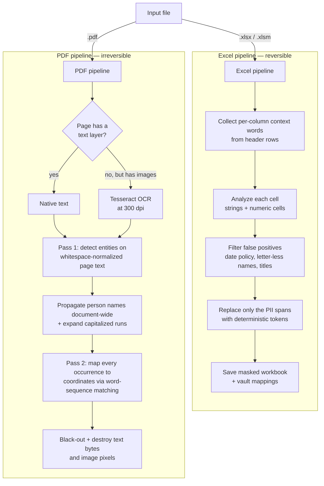

# Sovereign AI — PII Masking Engine

A pseudonymization and redaction engine for Excel workbooks and PDF documents, built on
[Microsoft Presidio](https://microsoft.github.io/presidio/), with first-class support for
**Sri Lankan identifiers** (NIC, +94 phone formats, passports) and **scanned documents via OCR**.

- **Excel** → reversible *pseudonymization*: PII is replaced with deterministic tokens
  (`TOK_US_SSN_8B584CCF`), and a vault file maps every token back to its original value.
- **PDF** → irreversible *redaction*: matched text is blacked out and the underlying
  bytes (or image pixels, for scans) are physically destroyed. The vault serves only as an
  audit log of what was removed.

---

## Contents

1. [How it works](#how-it-works)
2. [Setup](#setup)
3. [Usage](#usage)
4. [LLM staging: masking before Claude / ChatGPT](#llm-staging-masking-before-claude--chatgpt)
4. [Options reference](#options-reference)
5. [The vault](#the-vault)
6. [What gets masked (and what doesn't)](#what-gets-masked-and-what-doesnt)
7. [Choosing the NLP model](#choosing-the-nlp-model)
8. [Test corpus](#test-corpus)
9. [Known limitations](#known-limitations)

Further reading: [`docs/TECHNICAL_DESIGN.md`](docs/TECHNICAL_DESIGN.md) (architecture,
security, performance), [`docs/TECHNOLOGIES.md`](docs/TECHNOLOGIES.md) (techniques explained),
and [`ROADMAP.md`](ROADMAP.md) (evaluated next steps with pros/cons).

## Project layout

```
maskroom/            the engine, installed as a package (`pip install -e .`)
  rules.py           generic detection policy: column rules, profile patterns, validators, entity lists
  locale.py          loads a country locale (YAML) and compiles it with the generic rules into a Policy
  locales/           lk.yaml (Sri Lanka), in.yaml (India starter), _template.yaml
  recognizers.py     Presidio recognizers: generic (financial, names) + built from the locale
  engine.py          FinancialPrivacyEngine: analyzer setup, text detection filters, tokens, vault
  excel.py           Excel pipeline: header/segment detection, column rules, mask & restore
  pdf.py             PDF pipeline: OCR, two-pass detection, spatial redaction
  cli.py             the `maskroom` command
extension/           Chrome extension for claude.ai (mask the composer, unmask replies on screen)
samples/             demo/test prompt sets with generated workbooks and a PDF (samples/README.md)
webui/               Flask UI + JSON API (app.py); static/index.html = file studio,
                     static/staging.html = LLM staging page; runs and session vaults
                     land in webui/runs/ (ignored)
  session.py         (in maskroom/) per-conversation vault store used by the API
tests/               pytest suite; tests/data/ holds the test corpus and the stress answer key
scripts/             gen_stress.py (regenerate the stress workbook), time_excel.py (timing)
docs/                technical design and technologies documents
setup.sh             one-shot environment setup
Dockerfile           container image for the web UI (gunicorn); render.yaml / fly.toml deploy configs
```

---

## How it works



### Detection stack

Every piece of text passes through one shared analysis path (`analyze_text`):

1. **Presidio built-in recognizers** — emails, credit cards (Luhn-validated), SSNs, IBANs,
   URLs, and spaCy NER for names, locations, and dates.
2. **Custom recognizers** registered on top:
   | Entity | Pattern | Notes |
   |---|---|---|
   | `FINANCIAL_ACCOUNT` | `ABC-1234-002`, bare 9–18 digit runs, `A/12345` refs | bare digits only mask near context words (*account, iban, routing, epf…*) |
   | `LK_NIC` | old `853421234V` and new 12-digit format | old format masks on its own; new format needs NIC context |
   | `LK_PASSPORT` | `N1234567` | requires *passport* context |
   | `PHONE_NUMBER` | re-registered with region **LK** + US/GB/IN | validates `+94` and `0XX` formats via `phonenumbers`; context includes landline vocabulary |
   | `EMAIL_ADDRESS` (loose) | OCR-tolerant regex, no TLD validation | catches OCR misreads like `.Ik` for `.lk` |
   | `PERSON` (role-titled) | capitalized word after *Mr/Dr/overseer/manager/…* | catches names statistical NER misses |
3. **Column rules (Excel)** — when a sheet's header row contains a recognizable identifier
   header (*name / officer name / address / NIC / email / phone / passport / account no /
   DOB…*), every cell **below** that header is masked wholesale, with no per-cell detection —
   100% recall regardless of value format (fixes e.g. all-caps `SURNAME, FIRST M` columns).
   The header row is auto-located in the top rows (first row with ≥2 short header-like
   cells), so title/description rows above it are fine. Guards: org-name headers
   (*department name, company name, sheet name…*) are excluded, "no data" markers (`-`,
   `N/A`) are skipped, and data cells can never trigger a rule. Disable with
   `--no-column-rules`. Header rows themselves are never analyzed (labels, not data).
   **Keep rules** go the other way: columns headed *City / Town / District / Province /
   Region / Country / Nationality…* are never analyzed at all — they hold aggregation
   dimensions, not people.
   **Stacked tables** on one sheet are segmented automatically (a header-like row after a
   blank row starts a new table with its own rules); transposed layouts fall back to
   per-cell detection.
4. **Value-profile rules (Excel)** — when ≥90% of a column's values match one
   high-precision, validated identifier pattern (NIC with day-of-year check, email, LK
   phone formats, Luhn-valid cards, structurally valid SSNs, passports), the column is
   treated as that identifier **regardless of its header** — cryptic headers (`C3`),
   Sinhala/Tamil headers, or no header at all. Numeric-stored identifiers are covered.
5. **Context enhancement** — for spreadsheets, words from each column's header rows are fed to
   Presidio's context enhancer, so a bare phone number in a *"Fixed Line"* column scores as it
   would inside a sentence. This is what makes structured-data detection work.
6. **Sri Lankan place gazetteer** — English NER does not know the country's geography and
   labels about half of its towns as people (*Kandy*, *Negombo*, *Dehiwala*, *Badulla*…).
   A "name" made only of known provinces, districts, towns or Colombo suburbs is relabelled
   a location, where the location policy applies (kept by default). *Kandy Perera* is
   still a person. Lone field-label words (*NIC*, *OTP*, *Email*) are never names.
7. **False-positive filters** — NER name/place labels on letter-less text are dropped (a salary
   is not a PERSON); PERSON/NRP spans containing digits (`EMP-100`, `WP CAB-1234`) and lone
   ≤3-letter tokens (`Max`, `Pro`) are dropped; "names" ending in a role word
   (*Hon. Attorney*) are dropped; the date policy (below) governs `DATE_TIME`; spans
   overlapping existing tokens are skipped, making re-runs idempotent. Presidio's
   country-specific recognizers irrelevant to this deployment (UK NHS, AU TFN, SG NRIC, IN
   Aadhaar, IT/ES/PL ids, US driver licence…) are disabled — their checksums fire on random
   numbers.

### Date, location & amount policy

Salaries, prices, and quantities are **never masked as amounts** — numbers only mask when they
match an identifier pattern (account, card, NIC). Dates follow a policy (`--dates`):

| Policy | Behavior |
|---|---|
| `birth` *(default)* | Only dates in a birth context are masked (a *Date of Birth* column, "born on…"). A DOB is a classic re-identification quasi-identifier; ordinary transaction/event dates stay analyzable. |
| `all` | Every detected date is masked (HIPAA-style). |
| `none` | No dates are masked. |

Locations follow the same idea (`--locations`): a city or district is something you analyze
*by*, while a street address points at one household.

| Policy | Behavior |
|---|---|
| `address` *(default)* | Only street-level addresses are masked — values with a house/box number or a street word (road, street, lane, mawatha, avenue, P.O. Box, apt…), plus any *Address* column. Bare city, district and country names (`Colombo`, `Jaffna`, `Sri Lanka`) stay. |
| `all` | Every detected place name is masked (use with the strict/quasi-identifier stance: city + title + DOB can single someone out). |
| `none` | No locations are masked, not even address columns. |

---

## Setup

### Prerequisites

| Requirement | Why | Check |
|---|---|---|
| Python 3.11+ | engine and web UI | `python3 --version` |
| `tesseract-ocr` (system package) | redacting **scanned** PDFs; native-text PDFs and Excel work without it | `tesseract --version` |
| ~1.5 GB disk (≈3 GB with the transformer model) | spaCy models, PyTorch | — |
| Internet access during setup | pip packages and model downloads | — |

On Debian/Ubuntu: `sudo apt install python3.11-venv tesseract-ocr`

### Option A — one-shot script (recommended)

```bash
cd /hms/apps/sovereign-ai/masking
./setup.sh            # core engine + web UI, default NER model (en_core_web_lg)
./setup.sh --trf      # additionally installs the transformer model (CPU PyTorch)
```

The script creates the `pii_env` virtualenv, installs pinned dependencies from
`requirements.txt`, downloads the spaCy model(s), and ends with a self-test that masks a
sample sentence. If it prints `engine OK -> Call TOK_PERSON_… on phone TOK_PHONE_NUMBER_…, NIC TOK_LK_NIC_…`, you're done.

### Option B — manual steps

```bash
cd /hms/apps/sovereign-ai/masking
python3 -m venv pii_env
pii_env/bin/pip install --upgrade pip
pii_env/bin/pip install -r requirements.txt
pii_env/bin/python -m spacy download en_core_web_lg
```

Optional transformer model (better name recall, 4–35× slower on CPU — see
[Choosing the NLP model](#choosing-the-nlp-model)). Install PyTorch from the CPU index
first, otherwise pip pulls the multi-GB CUDA build:

```bash
pii_env/bin/pip install torch --index-url https://download.pytorch.org/whl/cpu
pii_env/bin/pip install -r requirements-trf.txt
pii_env/bin/python -m spacy download en_core_web_trf
```

### Configure the token salt

Tokens are derived from `SHA-256(value + salt)`. The salt is what stops anyone from
reconstructing tokens for guessed values, so set your own and keep it secret — the same
salt must be used whenever consistent tokens across files are needed:

```bash
export PII_TOKEN_SALT="choose-a-long-random-secret"
```

Put it in the service environment / shell profile rather than on the command line history.
Without it the engine falls back to a built-in default salt, which is fine for testing only.

### Verify the install

```bash
pii_env/bin/maskroom tests/data/PII_Test_Dataset_LK.xlsx /tmp/check.xlsx --vault /tmp/check_vault.json
# expected: "[Success] Excel saved to: /tmp/check.xlsx (… cells modified)"
pii_env/bin/maskroom tests/data/PII_Test_Sample_LK_SCANNED.pdf /tmp/check.pdf
# expected: "[OCR] Page 1 has no text layer — running OCR" then "[Success] PDF saved …"
pii_env/bin/pytest -q
# expected: all tests pass (~3–5 min on the default model; adds the stress, round-trip and PDF gates)
```

If the second command prints a Tesseract warning instead of `[OCR]`, install `tesseract-ocr`
and re-run — scanned pages are otherwise left **un-redacted** (the engine warns loudly, it
never fails silently).

### Start the web UI

```bash
pii_env/bin/python webui/app.py
# → open http://127.0.0.1:5170
```

First start takes 30 s – 2 min while the NLP stack loads (longer once the transformer stack
is installed); the page answers as soon as the Flask banner appears. The server binds to
localhost only and stops with the terminal that started it. To keep it running permanently,
run it under a process manager — a minimal systemd user unit:

```ini
# ~/.config/systemd/user/maskroom.service
[Unit]
Description=PII masking web UI
[Service]
WorkingDirectory=/hms/apps/sovereign-ai/masking
Environment=PII_TOKEN_SALT=choose-a-long-random-secret
ExecStart=/hms/apps/sovereign-ai/masking/pii_env/bin/python webui/app.py
Restart=on-failure
[Install]
WantedBy=default.target
```

```bash
systemctl --user daemon-reload && systemctl --user enable --now maskroom
```

### Deploy as a container

The web UI is a long-running server with a ~1 GB in-memory NLP model, Tesseract and a
local scratch directory, so static/serverless hosts (Netlify, Vercel, Cloudflare Pages)
cannot run it. Deploy the `Dockerfile` on any platform that keeps one container alive
with **2 GB RAM or more**; the image is ~2 GB and the first request after a deploy takes
up to a minute while the model loads.

```bash
docker build -t maskroom .
docker run --rm -p 8080:8080 -e PII_TOKEN_SALT="choose-a-long-random-secret" maskroom
# → open http://127.0.0.1:8080
```

The container runs gunicorn with one worker (each worker would load its own copy of the
model) and reads `HOST` / `PORT` from the environment. Ready-made configs:

| Platform | Config | Deploy |
|---|---|---|
| Render | `render.yaml` | New → Blueprint, pick the repo, set `PII_TOKEN_SALT` in the dashboard |
| Fly.io | `fly.toml` | `fly launch --copy-config --no-deploy`, `fly secrets set PII_TOKEN_SALT=…`, `fly deploy` |
| Cloud Run / others | `Dockerfile` | build & push the image; set min instances to 1 so the model stays loaded |
| Own VPS | `Dockerfile` | `docker run` as above under systemd; the only option where data never leaves your infrastructure |

Before exposing it publicly:

- **Add authentication.** The UI and `/api/*` endpoints have no login; put them behind an
  auth proxy (Cloudflare Access, oauth2-proxy, your platform's SSO) or a private network.
- **Choose the region deliberately.** Uploads contain PII; both configs default to
  Singapore — change `region` / `primary_region` to match your data-residency needs.
- **Treat `webui/runs/` as ephemeral.** It lives on the container filesystem and is lost
  on redeploy; download masked files and vaults promptly.
- **Skip the transformer model** unless the instance has 4 GB+ RAM.

### Troubleshooting

| Symptom | Cause / fix |
|---|---|
| `Port 5170 is in use` | a previous server is still running: `pkill -f "webui/app.py"` then restart |
| `OSError: [E050] Can't find model 'en_core_web_lg'` | model download skipped — run the `spacy download` step |
| `[Warning] … Tesseract language data was not found` | install `tesseract-ocr`; or point `TESSDATA_PREFIX` at the tessdata directory |
| `--nlp-model en_core_web_trf` fails to load | transformer extras not installed — run `./setup.sh --trf` |
| Very slow first request | model loading on first use; subsequent requests are fast |
| `ModuleNotFoundError: flask` | web UI deps missing — `pii_env/bin/pip install -r requirements.txt` |

---

## Usage

### Mask an Excel workbook (reversible)

```bash
pii_env/bin/maskroom data.xlsx data_masked.xlsx --vault vault.json
```

### Restore the original from a masked workbook

```bash
pii_env/bin/maskroom data_masked.xlsx data_restored.xlsx --restore --vault vault.json
```

Restore is exact — values *and* cell types (numeric cells return as numbers, text identifiers
like NICs stay text). It requires the vault saved during masking.

### Redact a PDF (irreversible; scans handled automatically)

```bash
pii_env/bin/maskroom document.pdf document_redacted.pdf --vault audit.json
```

Pages without a text layer are OCR'd automatically (`[OCR] Page N has no text layer`).
Redaction destroys the matched text bytes and image pixels — **a redacted PDF cannot be
restored**; the vault is an audit log only.

### Use the transformer model for better name recall

```bash
pii_env/bin/maskroom report.pdf --nlp-model en_core_web_trf
```

### Web UI

```bash
pii_env/bin/python webui/app.py     # then open http://127.0.0.1:5170
```

Upload a workbook or PDF, set every CLI option (threshold, NER model, date policy, entity
whitelist, restore-with-vault), and get: coverage stat tiles, a findings table with every
detection's location, entity type, and confidence score, a highlighted before/after preview
(Excel as tables, PDF as page renders), and download links for the masked file and vault.
The server binds to localhost only — uploaded files and vaults land in `webui/runs/`;
clear that directory as you would any sensitive working data.

### Python API

```python
from maskroom import FinancialPrivacyEngine

engine = FinancialPrivacyEngine(
    min_score=0.6,              # detection confidence threshold
    dates="birth",              # "birth" | "all" | "none"
    locations="address",        # "address" | "all" | "none"
    locale="lk",                # "lk" | "in" | path/to/locale.yaml | "generic"
    nlp_model=None,             # or "en_core_web_trf"
    entities=None,              # or a whitelist, e.g. ["PERSON", "LK_NIC"]
)

engine.pseudonymize_excel("in.xlsx", "out.xlsx")
engine.save_vault("vault.json")

engine.redact_spatial_pdf("in.pdf", "out.pdf")

# free-text helpers
masked, changed = engine.pseudonymize_text("Call Nimal on 077-1234567")
original = engine.depseudonymize_text(masked)
# tolerant restore of an LLM reply: case/separator changes and truncated
# ids are resolved against the vault; anything else is reported, not guessed
restored, report = engine.unmask_text("as tok person 3f9a1c22 said ...")
# report == {"restored": 1, "fuzzy": [...], "unresolved": [...], "values": [...]}

# PDF as masked text (reversible) instead of black boxes — for LLM input
masked_md = engine.pseudonymize_pdf_text("in.pdf", "in_masked.md")

# reverse a workbook later
engine2 = FinancialPrivacyEngine()
engine2.load_vault("vault.json")
engine2.depseudonymize_excel("out.xlsx", "restored.xlsx")
```

---

## LLM staging: masking before Claude / ChatGPT

Chat products such as claude.ai, Claude Cowork or ChatGPT offer no supported hook for
rewriting what a user sends, so the honest architecture is a **staging area**: mask here,
paste the safe version there, paste the reply back here to restore names. See
[`docs/LLM_MIDDLEWARE_RESEARCH.md`](docs/LLM_MIDDLEWARE_RESEARCH.md) for why the other
interception points (browser extension, MCP, gateway, hooks) do or do not work.

```bash
pii_env/bin/python webui/app.py     # then open http://127.0.0.1:5170/staging
```

The page has three steps that share one **session vault**:

1. **Mask text** — paste a prompt; every detected name, identifier, contact detail and
   street address becomes a `TOK_<TYPE>_<ID>` pseudonym. *Copy for Claude* puts the masked
   text on the clipboard, prefixed (optionally) with a one-line instruction telling the
   model to treat tokens as opaque labels and repeat them verbatim.
2. **Mask files** — drop `.xlsx`/`.pdf`/`.docx`/`.pptx`. Excel gives a masked workbook plus a Markdown
   rendering (for chat surfaces without spreadsheet support); PDFs come back as masked
   **text**, one section per page, instead of black boxes; Word/PowerPoint (`.docx`/`.pptx`)
   are masked in place (text runs pseudonymized, formatting kept), so the model still sees the
   content. Everything joins the same vault, so the same person gets the same token in the
   prompt and in the attachment.
3. **Unmask the reply** — paste the answer; tokens are restored even when the model
   lowercased them, swapped underscores for spaces or hyphens, escaped them for Markdown or
   truncated the id. Near-matches are listed as such and anything unresolved is shown in
   red, never guessed.
4. **Unmask a file Claude made** — drop a spreadsheet, Word/PowerPoint file, Markdown or
   CSV that Claude generated; it comes back with the real values, and anything unresolved is
   listed (and noted inside workbooks and Markdown). PDFs are not supported.

Ready-made prompt sets and files for testing or demoing this workflow are in
[`samples/README.md`](samples/README.md).

A session lives in `webui/runs/sessions/<id>/vault.json`, is shared by every call that
carries its id, gets its own token salt (tokens from two sessions never coincide), can be
downloaded, and is deleted on *end session* or after `SESSION_TTL_HOURS` (default 24) of
inactivity. What the staging area cannot do is enforce anything: a user can still type
directly into the chat app. Pair it with an organisational control (Claude Enterprise
inference hooks can *deny* prompts containing raw identifiers) if masking must be mandatory.

### Browser extension for claude.ai

[`extension/`](extension/README.md) holds an unpacked Chrome extension that talks to this
server: a *Mask* button (and a guard on Enter/send) pseudonymizes the composer text in
place — you still press send yourself — *Mask file* attaches the masked version of a
workbook or PDF instead of the original (guard also catches files dropped on claude.ai),
and replies are restored on screen only. It is unsupported by Anthropic; see the extension
README for the install steps and the terms-of-service caveat.

### Admin audit dashboard

Every mask, unmask and file operation is recorded to an on-disk audit trail so an
administrator can review, at [`/admin`](http://127.0.0.1:5170/admin), exactly what each user
sent and the masked version that resulted. Each record keeps the **original input and the
masked output** (and the original/masked files for file operations), attributed to the org
user id the extension sends as `X-Maskroom-User` (set via managed policy — see
[`docs/ENTERPRISE_ENFORCEMENT.md`](docs/ENTERPRISE_ENFORCEMENT.md)).

> **The audit store contains real PII** (the original inputs). It is gated by a **separate
> admin key** (`MASKROOM_ADMIN_KEY`, distinct from the per-user `MASKROOM_API_KEY`) and
> auto-deleted after `AUDIT_TTL_DAYS` (default 90; `0` keeps forever). Keep it on protected
> storage; retention bounds exposure but is not encryption.

The dashboard shows stat tiles, a filterable table (user, action, date range, search) and a
per-record view with the original beside the masked version and file downloads. Set
`MASKROOM_ADMIN_KEY` to require sign-in; without it the audit API is open (local demo only).

### JSON API

Every route is also usable from scripts, gateways, hooks or an MCP server. Set
`MASKROOM_API_KEY` to require an `X-API-Key` header (or `?key=`) on all `/api/*` routes.

| Route | Body / form | Returns |
|---|---|---|
| `POST /api/session` | – | `{session_id, created, vault_entries}` |
| `GET /api/session/<id>` | – | session info |
| `DELETE /api/session/<id>` | – | `{deleted}` |
| `GET /api/session/<id>/vault` | – | the vault JSON (protect it) |
| `POST /api/mask` | JSON `{text, session_id?, locale?, dates?, locations?, min_score?, entities?, nlp_model?}` | `{session_id, masked, changed, findings[{entity,score,text,token}], vault_entries, preamble, elapsed_s}` — omit `session_id` to start a session |
| `POST /api/unmask` | JSON `{text, session_id}` | `{text, restored, fuzzy[{seen,token}], unresolved[], values[]}` |
| `POST /api/unmask-file` | multipart `file` + `session_id` | restores tokens inside a file the LLM produced (`.xlsx/.xlsm`, `.docx/.pptx`, `.md/.txt/.csv/.tsv/.json/.html/.xml/.yaml`) → `{restored, fuzzy, unresolved, downloads.output}`; unresolved tokens are also noted inside workbooks (sheet *Maskroom notes*) and Markdown/HTML (trailing comment); PDFs → 415 |
| `POST /api/process` | multipart `file` + options; `session_id` or `session=true`; `pdf_mode=text\|redact`; `restore=true` with a `vault` file **or** a `session_id`; `preview=false` to skip previews | run summary with `downloads.output`, `downloads.text` (`masked.md`), `downloads.vault` |
| `GET /api/download/<run>/<file>` | – | the file |
| `GET /api/text/<run>/<file>.md` | – | `{text}` (for copy-to-clipboard) |
| `GET /api/config` | – | `{auth_required, locales, default_locale, session_ttl_hours, preamble, admin_auth_required, audit_ttl_days}` (never needs a key) |
| `GET /api/audit` | `?user=&action=&since=&until=&q=&limit=&offset=` | audit records (metadata) — **admin key only** |
| `GET /api/audit/<id>` | – | one record with original input + masked output — admin key only |
| `GET /api/audit/<id>/file/<input\|output>` | – | the stored original or masked file — admin key only |
| `GET /api/audit/stats` | – | totals by action/user + retention — admin key only |

```bash
SID=$(curl -s -X POST localhost:5170/api/session | jq -r .session_id)
curl -s localhost:5170/api/mask -H 'content-type: application/json' \
  -d "{\"text\":\"Nimal Perera, NIC 853421234V, 077-1234567\",\"session_id\":\"$SID\"}" | jq .masked
curl -s localhost:5170/api/unmask -H 'content-type: application/json' \
  -d "{\"text\":\"tok person 8b584ccf is overdue\",\"session_id\":\"$SID\"}" | jq .
```

Engines are built once per option set and share one spaCy model load; all analysis is
serialized through one lock (the first request after start-up pays the model load). Text
bodies are capped at `MAX_TEXT_CHARS` (default 200 000).

---

## Options reference

| Flag | Default | Meaning |
|---|---|---|
| `input` | — | `.xlsx`, `.xlsm`, `.pdf`, `.docx`, or `.pptx` file |
| `output` | `<input>_masked.<ext>` | output path |
| `--vault FILE` | off | write (mask) or read (`--restore`) the token↔value mapping |
| `--restore` | off | reverse a masked workbook using `--vault` (Excel only) |
| `--min-score F` | `0.6` | minimum detection confidence to mask |
| `--entities E…` | all | restrict to specific entity types |
| `--nlp-model M` | `en_core_web_lg` | spaCy NER model, e.g. `en_core_web_trf` |
| `--dates P` | `birth` | date policy: `birth` / `all` / `none` |
| `--locations P` | `address` | location policy: `address` / `all` / `none` |
| `--locale L` | `$PII_LOCALE` or `lk` | country knowledge: bundled code (`lk`, `in`), a YAML path, or `generic` |

---

## The vault

`vault.json` holds `{token: original_value}` mappings plus which tokens came from numeric
cells (so restore preserves cell types).

> **The vault is the re-identification key.** Anyone holding it can reverse the masked file.
> Store it encrypted or in a secrets store, always separated from wherever the masked data
> goes. The masked output is only as protected as this file.

Tokens are deterministic: the same value + same salt always produces the same token, so
referential integrity holds across sheets, files, and runs (joins on a masked column still
work). Changing `PII_TOKEN_SALT` changes all tokens. Session vaults (see
[LLM staging](#llm-staging-masking-before-claude--chatgpt)) derive a per-session salt from
it with HMAC, so tokens are stable within a conversation but differ between conversations.

---

## What gets masked (and what doesn't)

**Masked:** names (including role-titled: "overseer Jayasuriya"), emails, phone numbers
(LK + international), NIC old/new, passports (with context), bank accounts, routing numbers,
EPF/ETF refs (with context), credit cards (valid Luhn), SSNs, street addresses,
birth dates.

**Kept:** salaries and monetary amounts, postal codes, invoice/case/vehicle numbers,
public hotlines (1919, 119), company registration numbers, transaction/event dates
(under the default policy), city/district/country names (under the default policy), job
titles, department and organization names.

Redaction errs toward over-masking (safe direction); pseudonymization errs toward precision.

---

## Localizing to another country

Nothing about Sri Lanka is hard-coded. All country knowledge lives in one YAML file under
`maskroom/locales/` and is selected with `--locale` (CLI), the *Locale* selector (web UI),
`locale=` (API) or the `PII_LOCALE` environment variable. `lk` is the default; `in` is a
starter for India; `generic` runs with no country rules at all.

A locale file declares:

| Key | What it drives |
|---|---|
| `identifiers` | one Presidio recognizer per national ID/passport/etc. (patterns + scores + context words), a **column-header rule** (whole column masked when the header matches) and an optional **value-profile rule** (column masked when ≥90% of values match the regex + validator, whatever the header says) |
| `phone_patterns`, `phone_profile_regex`, `phone_regions` | local phone formats and the regions for the `phonenumbers` validator |
| `enable_builtin` | which of Presidio's country recognizers (`IN_AADHAAR`, `UK_NHS`, `ES_NIF`…) to switch on — all are off by default because their checksums fire on random numbers |
| `honorifics` | local titles/role nouns so "*Shri* Ramesh" / "*Mudaliyar* Silva" count as people |
| `address_words` | local street vocabulary (*mawatha*, *nagar*, *marg*) for the address policy |
| `places` | gazetteer of provinces/districts/towns — NER mislabels unfamiliar towns as people; this relabels them as places |

To add a country:

```bash
cp maskroom/locales/_template.yaml maskroom/locales/xx.yaml   # edit: code, name, identifiers, places…
pii_env/bin/maskroom data.xlsx out.xlsx --locale xx             # or --locale /path/to/xx.yaml
pii_env/bin/pytest -q tests/test_locale.py                      # template/schema checks
```

Validators referenced by name in `profile.validator` are `luhn`, `ssn`, `lk_nic`, `verhoeff`
(Aadhaar); add new ones to `rules.VALIDATORS`. The generic layer (emails, cards, accounts,
inverted all-caps names, date/location policies, column and keep rules) applies to every locale.

---

## Choosing the NLP model

Benchmarked on real data (US public-employee records, a Supreme Court judgment, an 1888
scanned report) — 2026-08-19, CPU only:

| Metric | `en_core_web_lg` (default) | `en_core_web_trf` |
|---|---|---|
| Hard non-Western names in sentences | 3/6 | **6/6** |
| Real all-caps `SURNAME, FIRST M` names | 45/60 | **56/60** |
| Well-formatted directory (names/emails/phones) | 85–86/86 | **86/86** |
| PDF leak tests (judgment, scan) | 0 leaks | 0 leaks |
| Excel runtime (146-row workbook) | **15 s** | 64 s |

**Recommendation:** default `lg` for spreadsheets and bulk jobs (pattern recognizers do most
of the work there); `--nlp-model en_core_web_trf` for name-heavy free-text documents.
Note that both models achieve zero PDF leaks thanks to role-title detection and document-wide
name propagation.

---

## Test corpus

| File | What it exercises |
|---|---|
| `PII_Redaction_Test_Dataset.xlsx` | generic structured/unstructured PII + edge cases |
| `tests/data/PII_Test_Dataset_LK.xlsx` | Sri Lankan formats: NIC, +94 phones, EPF/ETF, LKR salaries |
| `tests/data/PII_Test_Sample_LK.pdf` | native-text letter with embedded LK PII |
| `tests/data/PII_Test_Sample_LK_SCANNED.pdf` | same letter as an image-only scan (OCR path) |
| `tests/data/SC_Judgment_Sample.pdf` | real Supreme Court judgment: dense legal text, repeated names |
| `tests/data/Ceylon_1888_Scan_Sample.pdf` | real 1888 scan: OCR noise, hard typography |
| `tests/data/Real_World_Directory.xlsx` | real public-employee data: normal + all-caps inverted names |
| `tests/data/PII_Stress_Test.xlsx` (+ `_key.json`) | hostile synthetic: cryptic & Sinhala headers, header at row 16, stacked tables, numeric-stored NICs, decoy columns, free text — with a machine-readable answer key |

---

## Known limitations

- **PDF redaction is permanent.** There is no restore for PDFs, by design.
- **OCR quality bounds scan redaction.** Clean scans work well; heavily skewed, low-contrast,
  or handwritten pages produce OCR text no recognizer can match. High-stakes scanned input
  deserves a human review pass.
- **Name columns with no recognizable header** (e.g. a Sinhala `නම` header) rely purely on
  NER; `lg` reaches ~92% on Sri Lankan names there, `trf` does better. Columns headed
  *name* (any casing) are rule-masked at 100%, and a dedicated pattern now catches
  all-caps inverted names (`JAYAWARDENA, SANDUNI D`) in free text.
- **Passports and free-format IDs** (e.g. `MRN-908123`) are only caught when a known pattern
  or context applies. Add a `PatternRecognizer` for any organization-specific ID format —
  see `setup_custom_financial_matchers()` for the template.
- **NER false positives** occasionally survive (a code like `EDGE-01` tagged as a name).
  Over-masking is the safe direction, but review pseudonymized output before analytics use.
